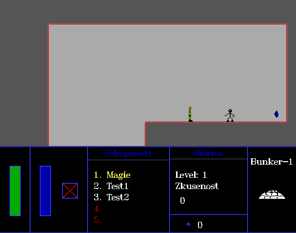

# Olorios
One of the projects from my childhood. I am not sure if it is even compilable but be my guest to try :)

  
  

- Sources codes are in Czech language.
- Binaries can be run using [DOSBox](https://www.dosbox.com/)

# Features
- Game objects saved in `txt` files defining pixel colors.
- The `txt` files format supports animation.
- Maps are saved in my original format which is by coincidence quite similar to `RLE`.

# Screenshots

