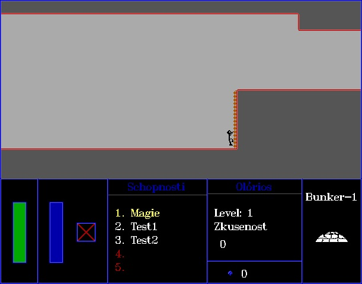

# Olorios
One of the projects from my childhood. I am not sure if it is even compilable but if you want to try, be my guest :blush:

  
  &nbsp;&nbsp;
   
  <em>The flickering is not a bug but "feature" - scene rendering is VERY unoptimized and computational heavy.</em>

- Source code is in Czech language.
- Binaries can be run using [DOSBox](https://www.dosbox.com/)

There are three `exe` files included:
- `Game.exe` - actual game,
- `Intro.exe` - short animation,
- `Menu.exe` - menu what supposed to be at the start.

# Features
- Game objects are saved in `txt` files defining pixel colors.
- The `txt` files format supports animation.
- Olorios is rendered via many hardcoded `PutPixel` calls each frame.
- Maps are saved in my original format which is by coincidence quite similar to `RLE`.

# Screenshots

  
  

  

  

